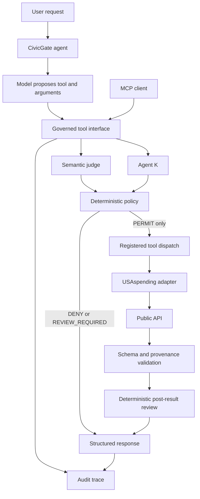

# Architecture

The CLI agent proposes one operation per request. It receives only an AgentModel and the GovernedTools interface. It cannot import the adapter or obtain an HTTP client through that interface. The in-process gateway and MCP stdio server use the same authorization path. The agent intentionally does not feed source text back into a recursive tool loop or generate consequential conclusions.

`models/` defines strict input, signal, provenance and envelope contracts. Unknown input fields are rejected. `governance/policy.py` is the only module issuing authority decisions. Its inputs are normalized immutable facts, judge signal, K signal and configured confidence threshold. The gateway serializes calls to preserve denial counters. `adapters/usaspending.py` alone maps to the fixed government origin. Only code in the trusted composition root may select a provider or inject a test transport.

Pre-execution policy runs before adapter dispatch. Post-execution policy can require clarification for ambiguous identity, incomplete provenance or conflicting source records. The trace retains the original PERMIT before an allowed factual lookup and the final REVIEW_REQUIRED when its results require clarification; `tool_executed=true` makes that distinction explicit.

USAspending responses are validated and projected to an intentionally small record shape. One page is returned. Monetary totals use Decimal. Both query and parsed source response receive SHA-256 fingerprints using canonical JSON serialization. These identify observed data; they are not government signatures or evidence of source accuracy.

The stdio process is the local trust/session boundary. There is no network MCP listener, multi-user identity system or autonomous review approval flow. A fresh process resets short-term containment counters; this is not durable cross-session enforcement. Persistent JSONL is an audit artifact, not agent memory.

The maintained MCP SDK 1.x API is pinned below 2 for FastMCP compatibility. Migration to SDK 2 requires an explicit compatibility review, not an unbounded dependency update.
